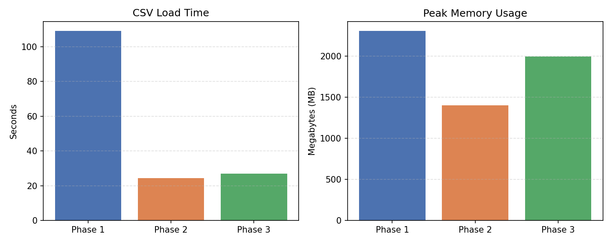
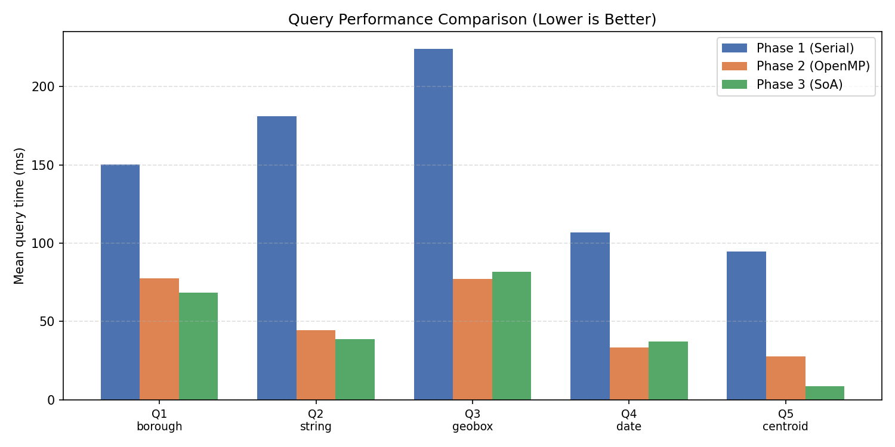
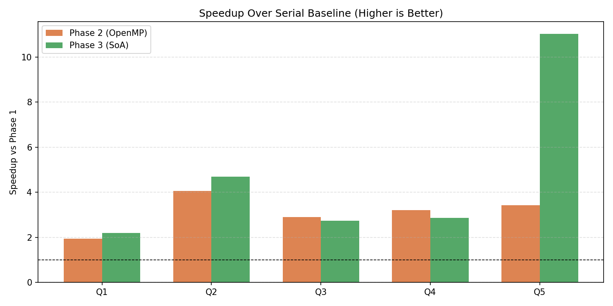

# Memory Overload - NYC 311 Service Requests

**CMPE 275 - Mini Project 1**  
**Team:** Ali Ucer, Anukrithi Myadala, Asim Mohammed

## 1. Introduction

We used the NYC 311 Service Requests dataset from NYC OpenData. 311 is New York's non-emergency complaint system - residents report issues like noise, illegal parking, broken streetlights, etc. We downloaded data from 2020 through 2026 using the Socrata API, split into 75 monthly CSV files. Total: 20,403,336 records, roughly 13 GB on disk.

We chose this dataset because it meets the size requirement (>2M records, >12 GB) and has a mix of field types: categorical (borough), temporal (dates), geographic (lat/lon), and free-text (complaint type). This variety lets us compare how different data types behave under different memory layouts.

All benchmarks ran on Google Colab with an AMD EPYC 7B12 (8 cores) and 50 GB RAM. We used g++ with `-O2` optimization. Each query was run 12 times and we report the mean.

## 2. Design

### Data Representation

The assignment says to pay attention to primitive types, so we converted fields at parse time instead of storing raw strings. Borough has only 5 possible values, so we encoded it as `enum Borough : uint8_t` - 1 byte per record instead of a ~10 byte string. Dates like `"2020-01-15T00:00:00.000"` get parsed into a `uint32_t` in `YYYYMMDD` format (e.g., `20200115`), which makes range queries a single integer comparison. Latitude and longitude are parsed into `double`.

We intentionally kept `complaint_type` as a `std::string` to measure how even a single heap-allocated field affects performance compared to the primitive-only fields. With this layout, each record is about 60 bytes - a naive all-string version would be 500+.

### Class Structure

| Class | Phase | Storage |
|-------|-------|---------|
| `IDataStore` | - | Abstract interface |
| `DataStore` | Phase 1 | Serial, `vector<Record311>` |
| `ParallelDataStore` | Phase 2 | OpenMP, `vector<Record311>` |
| `VectorStore` | Phase 3 | SoA, one vector per column |

All three implement the same interface, so the benchmark runner works with any phase without changes. `CSVParser<T>` is a template that reads the header row and builds a `ColumnMap` to find columns by name - this way it handles any column ordering.

### Queries

We benchmark 5 queries across all three phases. The first four are **filter queries** that return a list of matching record indices. The last one is a **reduction** that computes a single result without building an output list.

- **Q1_borough** - find all complaints from Brooklyn. Compares a 1-byte enum per record.
- **Q2_string** - find all "Noise - Residential" complaints. Compares a heap-allocated `std::string` per record.
- **Q3_geobox** - find all complaints within a lat/lon bounding box (roughly Manhattan). Checks two `double` fields per record.
- **Q4_date** - find all complaints filed in 2022. Compares a `uint32_t` date per record.
- **Q5_centroid** - compute the average latitude/longitude of all valid records. Pure math, no output vector.

The filter vs reduction distinction matters: filter queries spend time both scanning data *and* building a result vector (`push_back` for every match), while the reduction only scans. This becomes important when comparing AoS vs SoA in Phase 3.

## 3. Phase 1 - Serial (AoS)

`std::vector<Record311>` - standard Array of Structs. All 75 CSV files loaded sequentially, all queries single-threaded. This is our baseline - every improvement in Phase 2 and 3 is measured against these numbers.

**Load:** 109.1 s | **Memory:** 2,304 MB | **Records:** 20,403,336



| Query | Mean (ms) | Hits |
|-------|-----------|------|
| Q1_borough | 150.2 | 6,094,561 |
| Q2_string | 181.1 | 2,346,948 |
| Q3_geobox | 223.9 | 6,447,701 |
| Q4_date | 106.8 | 3,169,960 |
| Q5_centroid | 94.8 | 20,037,886 |

All queries finish under 225 ms on 20M records. This is already fast compared to string-heavy implementations because we use primitive types. Q3_geobox is slowest (two double comparisons per record), Q4_date is fastest filter (single integer comparison).

## 4. Phase 2 - OpenMP (AoS)

Same data layout as Phase 1, but with OpenMP:

- **File loading:** `#pragma omp parallel for schedule(dynamic, 1)` - one thread per CSV file. We use `dynamic` scheduling because file sizes vary by month; `static` would leave some threads idle while others process larger files.
- **Filters:** each thread builds a local result vector, merged via `#pragma omp critical`
- **Centroid:** `#pragma omp reduction(+:sum_lat, sum_lon)` - no lock needed, each thread accumulates locally

**Load:** 24.3 s | **Memory:** 1,400 MB | **Threads:** 8

| Query | Mean (ms) | vs Phase 1 |
|-------|-----------|------------|
| Q1_borough | 77.6 | 1.9× |
| Q2_string | 44.6 | 4.1× |
| Q3_geobox | 77.3 | 2.9× |
| Q4_date | 33.4 | 3.2× |
| Q5_centroid | 27.7 | 3.4× |

Loading improved 4.5× (109s → 24s). Query speedups range 1.9×–4.1× on 8 threads, well short of 8×. The queries are memory-bandwidth-bound - adding threads doesn't give more memory bandwidth. The `omp critical` merge also adds overhead when multiple threads try to append results simultaneously.

## 5. Phase 3 - SoA (Structure of Arrays)

Instead of one vector of structs, each field gets its own vector:

```cpp
vector<Borough>     boroughs_;        // 20M × 1 byte
vector<uint32_t>    created_ymds_;    // 20M × 4 bytes
vector<string>      complaint_types_; // 20M × ~40 bytes (heap)
vector<double>      latitudes_;       // 20M × 8 bytes
vector<double>      longitudes_;      // 20M × 8 bytes
```

Each query only reads the arrays it needs.

**Load:** 27.0 s | **Memory:** 1,993 MB



| Query | Mean (ms) | vs Phase 1 | vs Phase 2 |
|-------|-----------|------------|------------|
| Q1_borough | 68.5 | 2.2× | 1.1× |
| Q2_string | 38.6 | 4.7× | 1.2× |
| Q3_geobox | 81.7 | 2.7× | 0.95× ← worse |
| Q4_date | 37.3 | 2.9× | 0.89× ← worse |
| Q5_centroid | 8.6 | **11.0×** | **3.2×** |



### Where SoA helped

**Q5_centroid** went from 94.8 ms to 8.6 ms (11x faster). It's the only reduction query - no output vector, no push_back, just summing two contiguous double arrays. The compiler can auto-vectorize this with SIMD, and `omp reduction` avoids any locking.

### Where SoA didn't help

**Q3_geobox** got slightly worse. It needs both lat and lon per record. In AoS they sit next to each other in the same struct (one cache line). In SoA they're in separate arrays, so the CPU reads from two different memory locations per record.

**Q1, Q2, Q4** showed small Phase 2 to Phase 3 improvements in scan speed, but the bottleneck is not scanning - it's building the output. These queries return millions of matching indices (Q1 returns 6M hits), and each match triggers a `push_back`. That allocation cost is the same regardless of memory layout.

This is why Q1_borough (1 byte per record) and Q3_geobox (16 bytes per record) end up at similar latencies (~68 vs ~82 ms) in Phase 3, even though borough should be 16x cheaper to scan. The scan itself is fast, but it's buried under the output construction noise.

### Filter vs Reduction

The results show that SoA benefit depends heavily on the **output type** of the query, not just the data layout. Our four filter queries all produce large result vectors, which limits SoA's advantage. The one reduction query (centroid) avoids output allocation entirely and shows the full benefit of contiguous memory access. In a real system, aggregate queries (counts, sums, averages) would benefit most from SoA, while search queries that need to return matching records would see diminishing returns.

## 6. String Experiment

We ran the same benchmarks with and without the `complaint_type` string field to isolate the cost of a single heap-allocated field.

- **Without strings:** Phase 1 memory = 1,024 MB
- **With one string:** Phase 1 memory = 2,304 MB

One `std::string` field doubled memory. In C++, each `std::string` stores a pointer to heap-allocated character data. For 20M records, that means 20M separate heap allocations scattered across memory.

In Phase 3, Q2_string took 38.6 ms while Q5_centroid took 8.6 ms. The 4.5x gap comes from two things: first, Q2 is a filter that returns 2.3M matching indices (each one a `push_back`), while Q5 is a reduction with no output vector. Second, `double` values in a `vector<double>` sit contiguously, so the CPU prefetches them efficiently. String contents are scattered across the heap - each comparison chases a pointer to a random memory location.

To isolate just the string cost, compare Q2_string (38.6 ms, 2.3M hits) against Q4_date (37.3 ms, 3.2M hits). Q4 returns more results but runs at the same speed, because it scans a contiguous `uint32_t` array instead of chasing heap pointers. The push_back cost is similar for both, so the difference in scan speed is hidden - but Q4 is doing more output work and still keeping up, which tells us the string scan is genuinely slower.

## 7. Failed Attempts & Lessons Learned

### 7.1 Local Machine - Swap Thrashing
First attempt was on a laptop with 16 GB RAM. Loading 13 GB of CSV consumed all physical memory and swapped to disk. Load time went from ~100s to 400+ seconds. We moved to Colab (50 GB) to get real memory benchmarks.

### 7.2 Socrata API & CSV Parsing
Socrata API limits rows per request - our first download only got 1,000 rows. We split downloads by month (72 files) and parallelized with `xargs -P 12`.

The first parser used hardcoded column indices. Socrata exports have different column order and lowercase headers. The parser produced 0 records without any errors. We fixed this by reading the header row and looking up columns by name (`ColumnMap`).

### 7.3 `omp critical` vs `omp reduction`
First centroid implementation used `omp critical` - all 8 threads competed for one lock on every iteration. Scaling was terrible. Switching to `omp reduction(+:)` let each thread accumulate locally and merge once at the end. This alone took centroid from ~80 ms to ~28 ms in Phase 2.

### 7.4 SoA - Not Always Faster
We expected SoA to improve everything. It didn't. GeoBox got slightly worse because lat and lon got separated into different arrays. Filter queries with millions of hits didn't improve much because the bottleneck shifted from scanning to output construction (push_back). SoA is great for reductions and single-column scans, but not for multi-column queries.

### 7.5 `std::move` Semantics
Early code used `push_back(rec)` which copies the string field for every record - 20M heap allocations. Using `push_back(std::move(rec))` transfers ownership without copying.

## 8. Conclusions

1. **Primitive types matter most.** Converting strings to enums and integers at parse time cut memory from ~15 GB to ~1 GB and made serial queries 10x faster.

2. **OpenMP helps I/O more than queries.** File loading got 4.5x faster with 8 threads. Queries only 2-4x because they're memory-bound, not compute-bound.

3. **SoA benefit depends on query output type.** Reduction queries (centroid) got 11x faster because they scan contiguous arrays without producing output. Filter queries that return millions of results saw minimal improvement because `push_back` cost dominates and is the same in both layouts.

4. **SoA can be worse for multi-column queries.** GeoBox needs lat and lon together. AoS keeps them side-by-side in the same struct; SoA separates them into different arrays, breaking co-locality.

5. **One string doubles memory.** Adding a single `std::string` field to 20M records doubled the footprint and made an equality check 4.5x slower than math on contiguous arrays.

## 9. Individual Contributions

| Member | Contributions |
|--------|--------------|
| Ali Ucer | Built data download/split scripts and CMake build system. Designed `IDataStore` interface, template `CSVParser`, and robust header-based `ColumnMap` parsing. Contributed to final report analysis. |
| Anukrithi Myadala | Designed `Record311` primitive encoding (`enum`, `uint32_t` dates). Implemented Phase 1 (Serial) queries and data loading. Added `std::move` optimizations. Implemented Phase 2 (OpenMP) load parallelization and thread-local filter vectors. |
| Asim Mohammed | Implemented OpenMP reduction for centroid to fix lock contention. Built Phase 3 (SoA) `VectorStore` class and adapted queries. Designed the String Experiment. Wrote `plot_static.py` for benchmark graphs. |

## 10. References

- NYC OpenData 311 Service Requests: https://data.cityofnewyork.us/resource/erm2-nwe9
- OpenMP Specification: https://www.openmp.org/specifications/
- Mike Acton, "Data-Oriented Design and C++", CppCon 2014
- Intel 64 and IA-32 Architectures Optimization Reference Manual
- cppreference.com - std::string, Small String Optimization

## Appendix: Hardware

| | |
|---|---|
| CPU | AMD EPYC 7B12 |
| Cores | 8 |
| RAM | 50 GB |
| OS | Linux 6.6.113+ x86_64 |
| Compiler | g++ -O2 |
| Platform | Google Colab |
